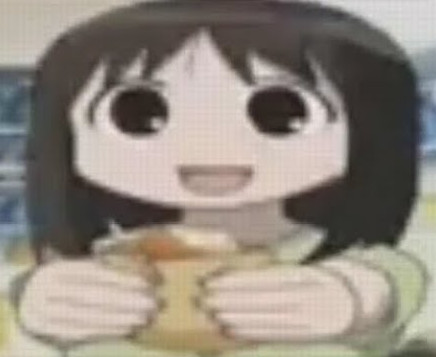

<h2> Bem vindo ao meu perfil </h2>

Olá, meu nome é Masao Muraoka Neto! Tenho 24 anos e estou focado em melhorar minhas abilidades em me tornar um desenvolvedor fullstack. Faço Engenharia de Computação na UFGD e estou no meu quarto ano de curso. Sou um artista e desenvolvedor de jogos nas horas vagas. 

**Linguagens:**
- GO (minha favorita)
- C/C++ (minha segunda favorita)
- Lua 
- Python
- PHP
- Node.js

**Ferramentas:**
- Visual Studio Code
- Gimp
- Krita
- Godot 

Se quiser entrar em contato:

 _mak08231

 

